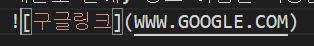
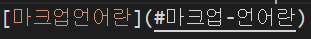

# 마크다운

Markdown은 텍스트 기반의 마크업언어<BR>
보통 readme.md에 자주 쓰이는 편

<br>

>#### 마크업 언어란
>마크업 언어(markup 言語, markup language)는 태그 등을 이용하여 문서나 데이터의 구조를 명기하는 언어의 한 가지이다.<br>
>일반적으로 자주 사용하는 HTML이나 XML도 이런 마크업 언어.


## 마크다운 문법
1. 줄바꿈  
일반적으로 사용하는 엔터 한번은 먹히지 않는다.  
마크다운 페이지를 작성하면서 맨 처음 당황한 부분은 바로 이 줄바꿈.  엔터 한번으로 일반적인 줄바꿈이 되지 않는다.  
띄어쓰기 두번 후 엔터를 치면 일번적인 줄바꿈이고 엔터 두번은 문단변경이다.  

2. 제목
#을 이용하여 제목을 구분할 수 있다.  
#은 최대 6개 까지 붙일 수 있으며 적게 붙일 수록 큰 제목이다. #을 작성후 띄어쓰기를 하면 제목으로 적용되며 따로 줄바꿈을 할 필요 없이 자동으로 줄바꿈이 가능하다.

3. 이텔릭체, 볼드체  
이텔릭체는 앞뒤를 _ 혹은 *로 감싸주기 _이렇게_   
볼드체는 __혹은 **으로 감싸준다. __이렇게__

4. 인용문  
인용문은 >을 앞에 붙여주면 된다.
    > 이렇게

    인용문에서 빠져나오기 위해서는 (엔터 두번) 문단바꾸가 필요  
    만약 >을 두번 붙여준다면?  
    > 괄호 1번사용
    >> 괄호 2번사용  
5. 코드블록  
코드를 사용 하고 싶다면 ```을 입력 후 사용하려는 언어를 선언하면 된다.  

    종료시에는 ```을 한번 더 입력하면 된다. 
    ```java
    System.print.out("이렇게");
    ```

6. 표  
표는 | 과 -을 이용하여 만들 수 있다.
|을 사용하면 칸이 되고 -을 사용하면 줄이 된다.-의 갯수는 중요하지 않다. 아래처럼 입력하면 위처럼 표현된다.  
  <BR>  |이렇게|이렇게|  
    |------|-----|  
    |1번|2번| 

    |이렇게|이렇게|  
    |------|-----|  
    |1번|2번|  

    줄구분과 :을 통해 정렬을 표현할 수도 있다.  
    :-- 왼쪽정렬 :--:가운데정렬 --: 오른쪽정렬  
    <bR>|왼쪽정렬|중앙정렬|오른쪽정렬|    
    |:------|:-----:|---:  
    |1번|2번|3번| 

    |왼쪽정렬|중앙정렬|오른쪽정렬|  
    |:------|:-----:|---:  
    |1번|2번|3번|  

7. 링크  
    []  () 대괄호와 소괄호를 붙여서 사용하며  
    대괄호 안에, 링크 이름을 작성한다.  
    [구글링크](WWW.GOOGLE.COM)

8. 이미지  
    링크 붙이는 방식 앞에 느낌표를 붙인다.
    

9. 문서 내 이동  
    링크와 비슷한 방법이나 소괄호 안에 #을 입력하여 제목을 정해준다.  
      
    [마크업언어란](#마크업-언어란)

10. 라인만들기   
   빼기 기호 3번이 상 작성시 라인이 생성된다.
---
11. 기타 
-  -기호를 시작으로 작성시
    - 탭 한뒤 - 기호 사용  
    


<br><br><br><br><br><br>
### 참고자료
> https://ko.wikipedia.org/wiki/%EB%A7%88%ED%81%AC%EC%97%85_%EC%96%B8%EC%96%B4 <br>
> https://ko.wikipedia.org/wiki/%EB%A7%88%ED%81%AC%EB%8B%A4%EC%9A%B4